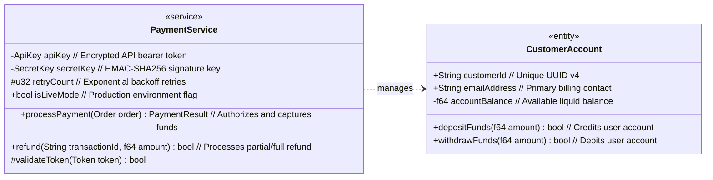

<div align="center">

# `merm`

### Blazingly Fast Native Linux Desktop Viewer for Mermaid Diagrams with Vim Modal Navigation & Deep Class Diagram Support

[](https://github.com/kadiryildiz/merm/actions/workflows/ci.yml)
[](LICENSE-MIT)
[](https://www.rust-lang.org)
[](#-installation)
[](#-designer-themes)

<br/>

```text
       ┌───────────────┐
       │   merm (v0.1) │◀─── Blazingly Fast Native Rust Binary
       └───┬───────────┘
           │
     ┌─────┴───────────────┐
     ▼                     ▼
[ WGPU 120FPS ]   [ Softbuffer SIMD ]
GPU Acceleration    Zero-Glitch CPU Fallback
```

</div>

---

## ⚡ Why `merm`?

Most existing Mermaid diagram tools rely on heavy web stacks: WebKitGTK wrappers, headless Chromium, or Electron apps that take seconds to launch, consume hundreds of megabytes of RAM, and don't integrate smoothly with modal terminal workflows.

**`merm`** is built from the ground up in safe, modern Rust for developers who live in terminal editors (Neovim, Helix, Kakoune):

- 🚀 **Instant Launch:** Renders and opens in **<50ms** (`merm arch.md` or `cat doc.md | merm -`).
- 💎 **Zero WebKit / Electron:** 100% native Rust binary using `winit`, `resvg`, and `softbuffer` / `wgpu`.
- 🎮 **120 FPS Fluid Interactivity:** Smooth GPU-accelerated canvas panning, zooming, and **interactive node drag-and-drop**.
- 📐 **Deep UML Class & Struct Diagram Support:** Full 3-compartment UML cards with syntax-highlighted visibility tokens (`+`, `-`, `#`, `~`), types, variables, methods, comments, and stereotypes.
- ⌨️ **Vim Modal Navigation:** Muscle-memory navigation with `hjkl`, `Tab` / `p` direction pivoting, `0` fit-to-view, and `/` node fuzzy jump.
- 🪟 **Terminal-First Transparent Mode:** Canvas transparency with Wayland alpha compositing (`with_transparent(true)`). No unwanted background is forced—your terminal's background, opacity (e.g. Ghostty `0.90`), blur, or desktop shows directly behind the diagram!
- 🎨 **8 Designer Themes:** Catppuccin Mocha, Tokyo Night, Nord, Gruvbox Dark, Dracula, Monokai, Monokai Terminal, and Catppuccin Latte.
- 🔌 **Bidirectional Editor IPC:** Real-time sync with Neovim (`merm.nvim`) via secure Unix Domain Sockets authenticated by the Linux kernel (`SO_PEERCRED`).
- 💤 **0% Idle CPU:** Event-driven architecture with zero polling thrash.

---

## 🏛️ Class & Struct Diagram Typography

`merm` treats UML and Struct diagrams as first-class citizens with code-editor quality syntax highlighting. Both block syntax and colon syntax are fully supported:



### Visual Breakdown:
- **Header:** Stereotype pill (`«interface»`, `«service»`, `«struct»`, `«entity»`), bold centered class title, and italic class docstring (`// Core financial processing service`).
- **Visibility Tokens:** `+` (Public: Green), `-` (Private: Red), `#` (Protected: Orange), `~` (Package: Purple).
- **Data Types:** Distinct syntax color in bold (e.g. Cyan in Monokai, Yellow in Catppuccin, Mint in Nord).
- **Variable Names:** Dedicated field color (`apiKey`, `customerId`).
- **Method Signatures:** Dedicated function color (`processPayment(Order order)`), return types (`PaymentResult`), and parameter lists.
- **Comments (`//` or `%%`):** Clean, italicized muted comments that never collide with code.
- **Colon Syntax Support:** Supports `ClassName : +type field // comment` and `<<interface>> ClassName`.
- **UML Relationships:** Full support for Inheritance (`<|--`), Realization (`..|>`), Composition (`*--`), Aggregation (`o--`), Association (`-->`), and Dependency (`..>`).

---

## ⌨️ Modal Controls & Keybindings

| Key | Mode | Action |
| :--- | :--- | :--- |
| `h`, `j`, `k`, `l` | Normal | Pan canvas left, down, up, right |
| `+` / `-` | Normal | Zoom in / Zoom out |
| `0` | Normal | Fit diagram to viewport |
| `Tab` or `p` | Normal | Pivot layout direction (`TD` ↔ `LR` ↔ `RL` ↔ `BT`) |
| `t` | Normal | Cycle color themes (Mocha → Tokyo Night → Nord → Gruvbox → Dracula → Monokai → Terminal → Latte) |
| `n` / `N` | Normal | Select and focus next / previous node |
| `/` or `f` | Normal | Enter Search / Jump mode |
| **Left Click + Drag** | Canvas | Pan canvas |
| **Left Click on Node** | Node | **Drag & drop node** (connected relationship arrows dynamically bend!) |
| **Mouse Wheel** | Canvas | Zoom in / out centered at cursor position |
| `q` or `Esc` | Any | Quit application |

---

## 🎨 Designer Themes

Switch themes on-the-fly using the `t` key in the GUI or start with `--theme <NAME>`:

| Theme Name | CLI Identifier | Description |
| :--- | :--- | :--- |
| **Monokai Terminal** | `terminal`, `term`, `monokai-terminal`, `transparent` | **Terminal-native transparent canvas.** Imposes no canvas background—inherits your terminal's background, opacity (e.g. Ghostty `0.90`), blur, or desktop wallpaper. Cards feature high-contrast translucent fills (`#181816f0`) and vibrant Monokai syntax highlighting. |
| **Monokai** | `monokai`, `monokai-remastered` | Classic Monokai Remastered dark theme with deep `#0c0c0c` background and crisp neon syntax. |
| **Catppuccin Mocha** | `catppuccin`, `catppuccin-mocha`, `mocha` | Soothing developer dark theme (Default). |
| **Tokyo Night** | `tokyo-night`, `tokyo` | Vibrant Japanese neon aesthetics with deep blues and purples. |
| **Nord** | `nord` | Arctic, north-bluish clean and calm palette. |
| **Gruvbox Dark** | `gruvbox`, `gruvbox-dark` | Warm retro groove contrast for warm-palette lovers. |
| **Dracula** | `dracula` | Gothic high-contrast dark theme with pink and green accents. |
| **Catppuccin Latte** | `latte`, `catppuccin-latte`, `light` | High-legibility light theme for bright environments. |

---

## 📦 Installation

### Arch Linux / CachyOS (AUR / PKGBUILD)
```bash
cd packaging
makepkg -si
```

### From Source (Cargo)
```bash
git clone https://github.com/kadiryildiz/merm.git
cd merm
cargo build --release --locked
install -Dm755 target/release/merm ~/.local/bin/merm
```

---

## 🚀 Usage

### Opening Files & Piping Stdin
```bash
# Open with default showcase diagram
merm

# Open with Terminal Transparent mode (inherits Ghostty/terminal opacity & blur)
merm -t terminal diagram.md

# Open with Monokai Remastered
merm -t monokai diagram.md

# Open example diagram
merm examples/class_diagram.md

# Pipe from stdin (ideal for fzf, git diff, or cat)
cat class_diagram.mmd | merm -

# Headless syntax check & batch verification
merm --headless path/to/diagram.md
```

### FreeDesktop App Launcher
`merm` includes a FreeDesktop-compliant desktop file (`packaging/merm.desktop`) and vector icon (`packaging/merm.svg`), allowing it to appear directly in your application launcher (Rofi, Wofi, GNOME, KDE, Hyprland, Sway).

```bash
install -Dm644 packaging/merm.desktop ~/.local/share/applications/merm.desktop
install -Dm644 packaging/merm.svg ~/.local/share/icons/hicolor/scalable/apps/merm.svg
```

---

## 🔌 Neovim Integration (`merm.nvim`)

`merm` ships with a native Lua plugin located in `editors/merm.nvim`:

```lua
-- lazy.nvim specification
{
  "kadiryildiz/merm",
  ft = { "markdown", "mermaid" },
  config = function()
    local merm = require("merm")
    merm.setup({
      auto_open = false,
      theme = "terminal", -- Use terminal transparent mode
    })

    -- Keybindings
    vim.keymap.set("n", "<leader>mv", merm.open, { desc = "Open in Merm" })
    vim.keymap.set("n", "<leader>mp", merm.pivot_direction, { desc = "Pivot Diagram Direction" })
  end,
}
```

---

## ⚙️ Configuration

`merm` reads user preferences from `~/.config/merm/config.toml`:

```toml
# merm configuration file
# Available themes: catppuccin-mocha, tokyo-night, nord, gruvbox, dracula, monokai, terminal, latte
theme = "terminal"

# Default diagram direction: "TD", "LR", "RL", "BT"
direction = "LR"
```

---

## 🏗️ Workspace Architecture

```text
merm/
├── Cargo.toml               # Workspace manifest with dual MIT/Apache-2.0 licenses
├── crates/
│   ├── merm-core/           # AST parser, direction pivoting, UML engine, 8 themes
│   ├── merm-render/         # WGPU pipeline, SIMD SvgRasterizer, alpha channel support
│   ├── merm-ui/             # winit 0.30, softbuffer, Wayland transparency, modal controller
│   ├── merm-ipc/            # SO_PEERCRED authenticated Unix socket server
│   └── merm-cli/            # Binary entry point and config loader
├── editors/
│   └── merm.nvim/           # Neovim plugin for live editor sync
├── examples/
│   └── class_diagram.md     # Rich UML showcase diagram
└── packaging/
    ├── merm.desktop         # FreeDesktop app launcher entry
    ├── merm.svg             # Application vector icon
    └── PKGBUILD             # Arch / CachyOS package script
```

---

## 🤝 Contributing

Contributions are welcome! Please review [CONTRIBUTING.md](CONTRIBUTING.md) and [CODE_OF_CONDUCT.md](CODE_OF_CONDUCT.md) before opening a pull request.

All submissions must pass:
```bash
cargo fmt --check
cargo clippy --all-targets -- -D warnings
cargo test --workspace
```

---

## 📄 License

Licensed under either of:

- Apache License, Version 2.0 ([LICENSE-APACHE](LICENSE-APACHE))
- MIT License ([LICENSE-MIT](LICENSE-MIT))

at your option.
