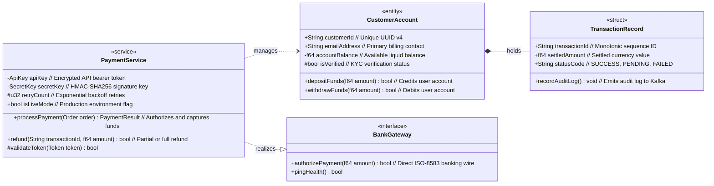

# Merm Demo Class Diagram

```mermaid
classDiagram
    direction LR

    %% High-throughput payment processing engine
    class PaymentService {
        <<service>>
        -ApiKey apiKey // Encrypted API bearer token
        -SecretKey secretKey // HMAC-SHA256 signature key
        #u32 retryCount // Exponential backoff retries
        +bool isLiveMode // Production environment flag
        +processPayment(Order order) PaymentResult // Authorizes and captures funds
        +refund(String transactionId, f64 amount) bool // Partial or full refund
        #validateToken(Token token) bool
    }

    %% Core customer profile and ledger account
    class CustomerAccount {
        <<entity>>
        +String customerId // Unique UUID v4
        +String emailAddress // Primary billing contact
        -f64 accountBalance // Available liquid balance
        #bool isVerified // KYC verification status
        +depositFunds(f64 amount) bool // Credits user account
        +withdrawFunds(f64 amount) bool // Debits user account
    }

    %% Immutable settlement transaction record
    class TransactionRecord {
        <<struct>>
        +String transactionId // Monotonic sequence ID
        +f64 settledAmount // Settled currency value
        +String statusCode // SUCCESS, PENDING, FAILED
        +recordAuditLog() void // Emits audit log to Kafka
    }

    %% External banking partner integration
    class BankGateway {
        <<interface>>
        +authorizePayment(f64 amount) bool // Direct ISO-8583 banking wire
        +pingHealth() bool
    }

    PaymentService ..> CustomerAccount : manages
    CustomerAccount *-- TransactionRecord : holds
    PaymentService ..|> BankGateway : realizes
```
